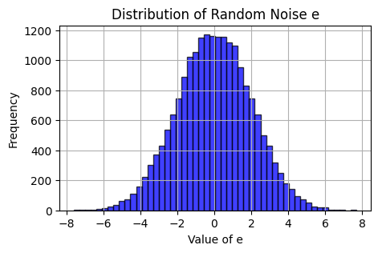
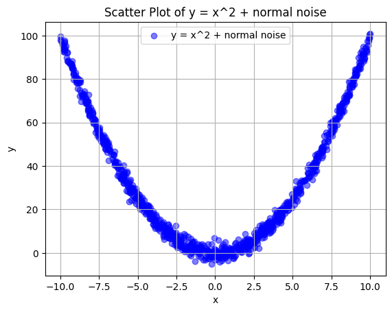
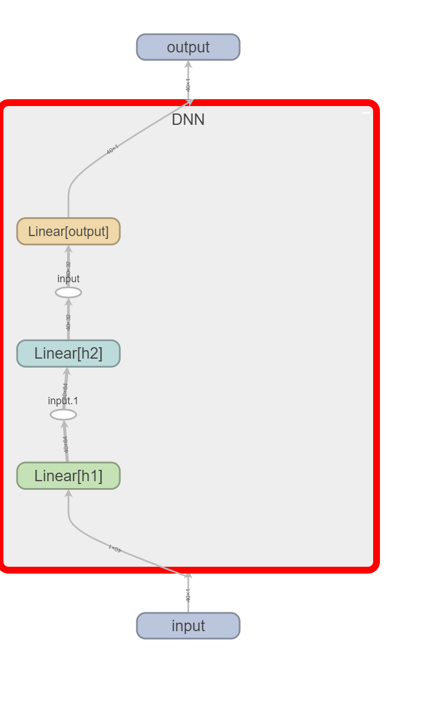
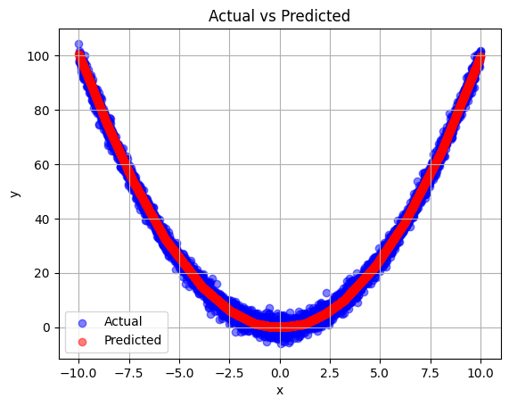

# 資料生成

### 定義 x 的範圍

我們使用 `numpy` 的 `linspace` 函數生成一個從 -10 到 10 的數值範圍，共 20002 個點，並將其重塑為列向量的形式。

```python
x = np.linspace(-10, 10, 20002).reshape(-1,1)
```

在這裡：
- `np.linspace(-10, 10, 20002)` 生成了一個包含 20002 個等間距點的數組，這些點從 -10 到 10。
- `.reshape(-1,1)` 將這些點重塑為列向量。

### 生成正態分布的隨機雜訊

為了給數據添加隨機性，我們生成一個與 `x` 形狀相同的正態分布隨機雜訊。雜訊的平均值設為 0，標準差設為 2。

```python
mean = 0  # 平均值
std_dev = 2  # 標準差
epsilon = np.random.normal(mean, std_dev, x.shape)
```

在這裡：
- `np.random.normal(mean, std_dev, x.shape)` 生成了一個正態分布的隨機數組，其平均值為 `mean`，標準差為 `std_dev`，形狀與 `x` 相同。

### 計算 y = x^2 + e

最後，我們計算二次函數 `y = x^2 + e`，其中 `e` 是上一步生成的隨機雜訊。

```python
y = x**2 + epsilon
```

這樣，我們就得到了帶有隨機雜訊的二次曲線數據。


```python
## 隨機雜訊的分佈圖

# 我們可以繪製隨機雜訊 `epsilon` 的分佈圖來更好地了解其特性。

plt.figure(figsize=(5, 3))
plt.hist(epsilon, bins=50, alpha=0.75, color='blue', edgecolor='black')
plt.title('Distribution of Random Noise e')
plt.xlabel('Value of e')
plt.ylabel('Frequency')
plt.grid(True)
plt.show()


```


    

    


在這裡：
- `plt.hist` 繪製了隨機雜訊的直方圖。
- `bins=50` 將數據分成 50 個柱狀區間。
- `alpha=0.75` 設置柱狀圖的透明度。
- `color='blue'` 設置柱狀圖的顏色。
- `edgecolor='black'` 設置柱狀圖邊緣的顏色。


```python
import numpy as np

# 定義 x 的範圍
x = np.linspace(-10, 10, 20002).reshape(-1,1)  # 從 -10 到 10 之間取 100 個點

# 生成正態分布的隨機雜訊
mean = 0  # 平均值
std_dev = 2  # 標準差
epsilon = np.random.normal(mean, std_dev, x.shape)

# 計算 y = x^2 + e
y = x**2 + epsilon

import matplotlib.pyplot as plt

# 繪製散點圖
indices = np.random.permutation(len(x))
plt_indices = indices[:1000]
plt.scatter(x[plt_indices], y[plt_indices], label='y = x^2 + normal noise', color='blue', alpha=0.5)
plt.xlabel('x')
plt.ylabel('y')
plt.title('Scatter Plot of y = x^2 + normal noise')
plt.legend()
plt.grid(True)
plt.show()


```


    

    


# 模型設定與訓練資料處理
```markdown
# 使用 PyTorch 訓練和測試帶有隨機雜訊的二次曲線模型

本文將介紹如何使用 PyTorch 訓練和測試一個帶有隨機雜訊的二次曲線模型。

## 引入所需的庫

我們首先引入所需的庫，包括 `torch`, `torch.nn`, `torch.optim`, `matplotlib.pyplot`, 以及一些 PyTorch 的工具模組。

```python
import torch
import torch.nn as nn
import torch.optim as optim
import matplotlib.pyplot as plt
from torch.utils.data import Dataset, DataLoader, TensorDataset
```

## 檢查是否有可用的 GPU

我們檢查系統是否有可用的 GPU，如果有的話，將裝置設置為 GPU，否則設置為 CPU。

```python
device = torch.device("cuda" if torch.cuda.is_available() else "cpu")
```

## 隨機分割數據集為訓練和測試數據

我們隨機打亂數據集，並將其分割為訓練數據和測試數據，訓練數據佔總數據的 80%，測試數據佔 20%。

```python
indices = np.random.permutation(len(x))
train_size = int(0.8 * len(x))
train_indices = indices[:train_size]
test_indices = indices[train_size:]

x_train, x_test = x[train_indices], x[test_indices]
y_train, y_test = y[train_indices], y[test_indices]
```

## 將數據轉換為 PyTorch 張量並創建 TensorDataset

我們將數據轉換為 PyTorch 張量，並創建訓練和測試的 `TensorDataset`。

1. **將數據轉換為 PyTorch 張量**：
   - PyTorch 使用張量（`Tensor`）作為基本數據結構，類似於 Numpy 的 `ndarray`。將數據轉換為張量後，便可以利用 PyTorch 提供的各種張量運算和自動微分功能，進行高效的數值計算。
   - 同時，將數據移動到指定的計算裝置（如 GPU）上，以加速計算。這在深度學習模型訓練中尤為重要，因為 GPU 的並行計算能力能顯著提升訓練速度。

2. **創建 TensorDataset**：
   - `TensorDataset` 是 PyTorch 中用於將特徵數據和標籤數據打包在一起的工具。這使得在模型訓練過程中能夠方便地同時獲取輸入數據及其對應的標籤。
   - 這一步將特徵數據 `x` 和標籤數據 `y` 封裝成一個數據集，便於後續操作。

```python
train_dataset = TensorDataset(torch.tensor(x_train, dtype=torch.float32).to(device), torch.tensor(y_train, dtype=torch.float32).to(device))
test_dataset = TensorDataset(torch.tensor(x_test, dtype=torch.float32).to(device), torch.tensor(y_test, dtype=torch.float32).to(device))
```

## 創建 DataLoader

我們使用 `DataLoader` 來加載訓練和測試數據集，這裡設置批量大小為 40。
3. **使用 DataLoader**：
   - `DataLoader` 是 PyTorch 中負責數據集加載的模塊。它能夠幫助我們以小批量（batch）的形式高效地加載數據，並且可以選擇是否對數據進行隨機打亂（shuffle），這對於訓練過程的隨機性和收斂速度有幫助。
   - 批量加載數據有助於減少內存佔用，並提高訓練過程的效率。

```python
train_loader = DataLoader(train_dataset, batch_size=40, shuffle=True)
test_loader = DataLoader(test_dataset, batch_size=40, shuffle=False)
```
1. **Batch Size**：
   - 每次訓練迭代中使用的樣本數量。
   - 在每個批次更新一次模型參數。

2. **Epoch**：
   - 整個數據集完整地通過模型一次。
   - 多個 epoch 用於逐步提高模型性能。

3. **Shuffle**：
   - 在每個 epoch 開始前將數據集隨機打亂，以提高模型的泛化能力。

## 定義神經網絡模型

我們定義了一個簡單的全連接神經網絡模型 `DNN`，該模型包含兩個隱藏層，並使用 ReLU 激活函數。

```python
class DNN(nn.Module):
    def __init__(self):
        super(DNN, self).__init__()
        self.h1 = nn.Linear(1, 64)
        self.h2 = nn.Linear(64, 32)
        self.output = nn.Linear(32, 1)

    def forward(self, x):
        x = torch.relu(self.h1(x))
        x = torch.relu(self.h2(x))
        x = self.output(x)
        return x
```

在這裡：
- `self.h1 = nn.Linear(1, 64)` 定義了第一個全連接層，輸入維度為 1，輸出維度為 64。
- `self.h2 = nn.Linear(64, 32)` 定義了第二個全連接層，輸入維度為 64，輸出維度為 32。
- `self.output = nn.Linear(32, 1)` 定義了輸出層，輸入維度為 32，輸出維度為 1。
- `torch.relu` 是 ReLU 激活函數，用於增加模型的非線性能力。

以上就是這段 PyTorch 代碼的詳細解釋，接下來可以對模型進行訓練和測試。
```


```python
import torch
import torch.nn as nn
import torch.optim as optim
import matplotlib.pyplot as plt
from torch.utils.data import Dataset, DataLoader, TensorDataset

# 檢查是否有可用的 GPU
device = torch.device("cuda" if torch.cuda.is_available() else "cpu")

# 隨機分割數據集為訓練和測試數據
indices = np.random.permutation(len(x))
train_size = int(0.8 * len(x))
train_indices = indices[:train_size]
test_indices = indices[train_size:]

# 分割數據集為訓練和測試數據
x_train, x_test = x[train_indices], x[test_indices]
y_train, y_test = y[train_indices], y[test_indices]

# 將數據轉換為 PyTorch 張量並創建 TensorDataset
train_dataset = TensorDataset(torch.tensor(x_train, dtype=torch.float32).to(device), torch.tensor(y_train, dtype=torch.float32).to(device))
test_dataset = TensorDataset(torch.tensor(x_test, dtype=torch.float32).to(device), torch.tensor(y_test, dtype=torch.float32).to(device))

# 創建 DataLoader
train_loader = DataLoader(train_dataset, batch_size=40, shuffle=True)
test_loader = DataLoader(test_dataset, batch_size=40, shuffle=False)


class DNN(nn.Module):
    def __init__(self):
        super(DNN,self).__init__()
        self.h1 = nn.Linear(1, 64)
        self.h2 = nn.Linear(64, 32)
        self.output = nn.Linear(32, 1)

    def forward(self,x):
        x = torch.relu(self.h1(x))
        x = torch.relu(self.h2(x))
        x = self.output(x)
        return x


```

# 簡單查看模型的架構，生成模型摘要報告


```python
from torchinfo import summary
model = DNN().to(device)
summary(model, input_size=(40, 1))
```


    ==========================================================================================
    Layer (type:depth-idx)                   Output Shape              Param #
    ==========================================================================================
    DNN                                      [40, 1]                   --
    ├─Linear: 1-1                            [40, 64]                  128
    ├─Linear: 1-2                            [40, 32]                  2,080
    ├─Linear: 1-3                            [40, 1]                   33
    ==========================================================================================
    Total params: 2,241
    Trainable params: 2,241
    Non-trainable params: 0
    Total mult-adds (M): 0.09
    ==========================================================================================
    Input size (MB): 0.00
    Forward/backward pass size (MB): 0.03
    Params size (MB): 0.01
    Estimated Total Size (MB): 0.04
    ==========================================================================================


# 使用 TensorBoard 可視化模型架構

本文將介紹如何在終端運行 TensorBoard 並使用 `torch.utils.tensorboard.SummaryWriter` 生成模型架構圖。

## TensorBoard

首先，確保已經安裝 TensorBoard。可以使用以下命令來生成run文件：

```bash
tensorboard --logdir=runs
```




```python
from torch.utils.tensorboard import SummaryWriter
writer = SummaryWriter()

t_input = torch.randn(40,1).to(device)  # 批量大小為1，序列長度為5，輸入特徵數為10

writer.add_graph(model, t_input)
writer.close()
```

# 批量梯度下降

### 小批量梯度下降（Mini-Batch Gradient Descent）

1. **分批次**：將整個數據集分成若干個小批次，每個批次的大小為 `batch_size`。例如，如果數據集有 1000 個樣本，`batch_size` 設為 40，那麼每個 epoch 將有 25 個批次。

2. **批次訓練**：在每個批次上進行一次前向傳播和反向傳播，計算損失和梯度，然後更新模型參數。

3. **完成一個 Epoch**：當所有批次都完成一次訓練後，這就完成了一個 epoch。每個樣本在這個 epoch 中都被用來訓練一次。

4. **隨機打亂數據（Shuffle）**：在新的 epoch 開始前，通常會將數據集重新隨機打亂（如果 `shuffle=True`），然後再次分成小批次進行訓練。

### 具體流程

假設有一個數據集 `x_train` 和 `y_train`，`batch_size` 設為 40，訓練 10 個 epoch。這是流程的具體步驟：

1. **第一個 Epoch**：
   - 將數據集打亂。
   - 將數據分成若干個小批次，每個批次 40 個樣本。
   - 每個批次依次進行訓練，更新模型參數。

2. **第二個 Epoch**：
   - 再次將數據集打亂。
   - 將數據重新分成若干個小批次，每個批次 40 個樣本。
   - 每個批次依次進行訓練，更新模型參數。

3. **重複以上步驟**直到所有 epoch 完成。

# 訓練模型

1. **訓練迭代次數**：`epochs = 100` 設置了訓練的總 epoch 數量，即模型將完整遍歷數據集 100 次。

2. **外層循環**：`for epoch in range(epochs)` 是外層循環，遍歷每一個 epoch。每個 epoch 表示模型已經完整地看過一遍訓練數據。

3. **設置模型為訓練模式**：`model.train()` 將模型設置為訓練模式，這樣會啟用一些僅在訓練時起作用的層（例如 dropout）。

4. **內層循環**：`for xb, yb in train_loader` 是內層循環，遍歷每個小批量數據（batch）。`train_loader` 是一個 DataLoader 對象，用於加載訓練數據。

5. **移動數據到設備**：`xb, yb = xb.to(device), yb.to(device)` 將小批量數據移動到指定的設備上（例如 GPU），確保計算在正確的設備上進行。

6. **清零梯度**：`optimizer.zero_grad()` 清零上一輪迭代的梯度。這一步很重要，因為 PyTorch 中的梯度是累積的。

7. **前向傳播**：`y_pred = model(xb)` 使用模型對輸入數據 `xb` 進行前向傳播，得到預測值 `y_pred`。

8. **計算損失**：`loss = criterion(y_pred, yb)` 使用損失函數計算預測值 `y_pred` 和真實值 `yb` 之間的損失。

9. **反向傳播**：`loss.backward()` 計算損失對模型參數的梯度。

10. **更新參數**：`optimizer.step()` 使用計算出的梯度更新模型參數。

11. **打印訓練進度**：`if (epoch + 1) % 10 == 0: print(f'Epoch {epoch + 1}/{epochs}, Loss: {loss.item()}')` 每 10 個 epoch 打印一次訓練損失，這樣可以跟蹤訓練進度和模型性能。

這段代碼展示了標準的 PyTorch 訓練循環，用於訓練深度學習模型。通過每個 epoch 中的前向傳播和反向傳播步驟，模型的參數會逐漸調整以最小化損失函數，從而提高模型的預測精度。


```python
# 定義損失函數和優化器
criterion = nn.MSELoss()
optimizer = optim.Adam(model.parameters(), lr=0.01)

# 基本訓練結構

# # 訓練模型
# epochs = 100
# for epoch in range(epochs):
#     model.train()
#     for xb, yb in train_loader:
#         xb, yb = xb.to(device), yb.to(device)  # 確保數據在正確的設備上
#         optimizer.zero_grad()
#         y_pred = model(xb)
#         loss = criterion(y_pred, yb)
#         loss.backward()
#         optimizer.step()
#     if (epoch + 1) % 10 == 0:
#         print(f'Epoch {epoch + 1}/{epochs}, Loss: {loss.item()}')
```

# 使用 `rich` 庫顯示模型訓練進度

本文介紹如何使用 `rich` 庫來顯示深度學習模型訓練的進度和損失值。

## 引入所需的庫

首先，我們需要引入 `rich` 庫中的 `Progress`, `Live` 和 `Table` 模塊。

```python
from rich.progress import Progress, Live
from rich.table import Table
```

## 設置訓練參數

我們設置訓練的 epoch 數量為 100。

```python
epochs = 100
```

## 初始化進度條和表格

使用 `Progress` 來顯示進度條，並使用 `Table` 來顯示當前的訓練 epoch 和損失值。

```python
progress = Progress()
table = Table(title="Training Progress")
table.add_column("Epoch", justify="right", style="cyan")
table.add_column("Loss", justify="right", style="magenta")

epoch_task = progress.add_task("[green]Training...", total=epochs)
```
### `justify` 選項

`justify` 用於設置表格列的對齊方式。可選值包括：

- `left`: 左對齊
- `center`: 居中對齊
- `right`: 右對齊

### `style` 選項

`style` 用於設置列文本的顏色和樣式。`rich` 支持多種顏色和文本樣式，以下是一些常用選項：

#### 顏色

- `black`
- `red`
- `green`
- `yellow`
- `blue`
- `magenta`
- `cyan`
- `white`
- `bright_black`
- `bright_red`
- `bright_green`
- `bright_yellow`
- `bright_blue`
- `bright_magenta`
- `bright_cyan`
- `bright_white`

#### 樣式

- `bold`
- `dim`
- `italic`
- `underline`
- `blink`
- `reverse`
- `conceal`

### `rich` 顏色和樣式參考

以下是 `rich` 支持的顏色和樣式的參考鏈接，便於查找和選擇合適的設置：

- 顏色參考：[Rich Color](https://rich.readthedocs.io/en/stable/appendix/colors.html)
- 樣式參考：[Rich Style](https://rich.readthedocs.io/en/stable/appendix/text.html#style)

## 訓練模型並更新進度條和表格

在 `Live` 環境中進行訓練，每個 epoch 結束後更新進度條和表格。

```python
with Live(progress, refresh_per_second=1) as live:
    for epoch in range(epochs):
        model.train()
        for xb, yb in train_loader:
            xb, yb = xb.to(device), yb.to(device)  # 確保數據在正確的設備上
            optimizer.zero_grad()
            y_pred = model(xb)
            loss = criterion(y_pred, yb)
            loss.backward()
            optimizer.step()

        progress.update(epoch_task, advance=1)

        # 清空表格並重新添加標題和最新的行
        table = Table(title="Training Progress")
        table.add_column("Epoch", justify="right", style="cyan")
        table.add_column("Loss", justify="right", style="magenta")
        table.add_row(f"{epoch + 1}/{epochs}", f"{loss.item():.4f}")

        # 組合進度條和表格
        progress_table = Table.grid(expand=True)
        progress_table.add_row(progress)
        progress_table.add_row(table)
        
        # 更新進度條和表格顯示
        live.update(progress_table)
```

### 關鍵點解釋

1. **進度條設置**：
   - 使用 `Progress` 來創建一個進度條對象，並通過 `add_task` 方法來添加一個任務，表示訓練過程中的進度。

2. **表格設置**：
   - 使用 `Table` 來創建一個表格對象，並添加列來顯示訓練的 epoch 和損失值。

3. **訓練循環**：
   - 在每個 epoch 中，對所有訓練數據進行前向傳播、計算損失、反向傳播和參數更新。
   - 更新進度條，並重新構建表格來顯示當前的 epoch 和損失值。

4. **Live 更新**：
   - 使用 `Live` 環境來動態刷新進度條和表格的顯示，每秒刷新一次。


```python
from rich.progress import Progress, Live
from rich.table import Table
# 訓練模型
epochs = 100

progress = Progress()
table = Table(title="Training Progress")
table.add_column("Epoch", justify="right", style="cyan")
table.add_column("Loss", justify="right", style="magenta")

epoch_task = progress.add_task("[green]Training...", total=epochs)

with Live(progress, refresh_per_second=1) as live:
    for epoch in range(epochs):
        model.train()
        for xb, yb in train_loader:
            xb, yb = xb.to(device), yb.to(device)  # 確保數據在正確的設備上
            optimizer.zero_grad()
            y_pred = model(xb)
            loss = criterion(y_pred, yb)
            loss.backward()
            optimizer.step()

        progress.update(epoch_task, advance=1)

        # 清空表格並重新添加標題和最新的行
        table = Table(title="Training Progress")
        table.add_column("Epoch", justify="right", style="cyan")
        table.add_column("Loss", justify="right", style="magenta")
        table.add_row(f"{epoch + 1}/{epochs}", f"{loss.item():.4f}")

        # 組合進度條和表格
        progress_table = Table.grid(expand=True)
        progress_table.add_row(progress)
        progress_table.add_row(table)
        
        # 更新進度條和表格顯示
        live.update(progress_table)

```


    Output()


<pre style="white-space:pre;overflow-x:auto;line-height:normal;font-family:Menlo,'DejaVu Sans Mono',consolas,'Courier New',monospace"></pre>


```python
# 評估模型
model.eval()
test_predictions = []
test_actuals = []
with torch.no_grad():
    for xb, yb in test_loader:
        xb, yb = xb.to(device), yb.to(device)  # 確保數據在正確的設備上
        y_pred = model(xb)
        test_predictions.append(y_pred.cpu())  # 將預測值移回 CPU
        test_actuals.append(yb.cpu())  # 將實際值移回 CPU

# 將所有批次的預測和實際值合併
test_predictions = torch.cat(test_predictions)
test_actuals = torch.cat(test_actuals)

# 計算測試損失
test_loss = criterion(test_predictions, test_actuals)
print(f'Test Loss (MSE): {test_loss.item()}')

# 繪製結果
plt.scatter(x_test, y_test, label='Actual', color='blue', alpha=0.5)
plt.scatter(x_test, test_predictions, label='Predicted', color='red', alpha=0.5)
plt.xlabel('x')
plt.ylabel('y')
plt.title('Actual vs Predicted')
plt.legend()
plt.grid(True)
plt.show()
```

    Test Loss (MSE): 4.390576362609863
    


    

    


```python
# MSE 接近理論MSE(4) 訓練成功
```
